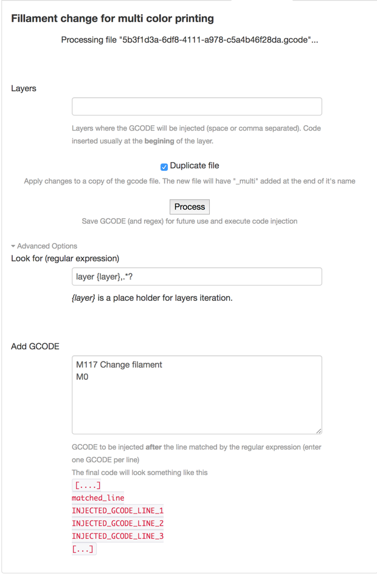

# OctoPrint-MultiColors

Octoprint plugin to inject GCODE for filament change at selected layers

Note: this plugin does NOT work with files on the SD card.

###Setup

Install via the bundled Plugin Manager or manually using this URL:

https://github.com/MoonshineSG/Octoprint-MultiColors/archive/master.zip

###Updates
1.0.2 - fix upload folder for other than RPi platfrom